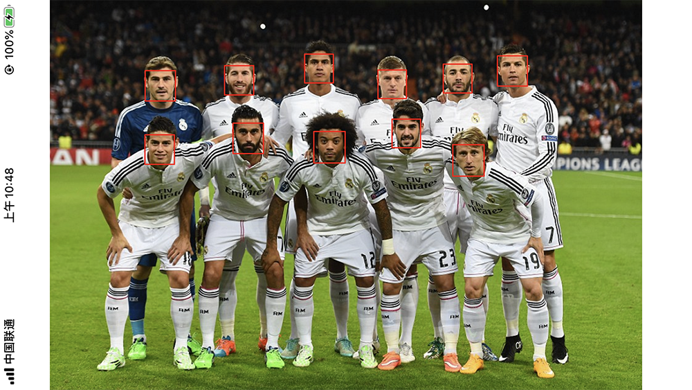
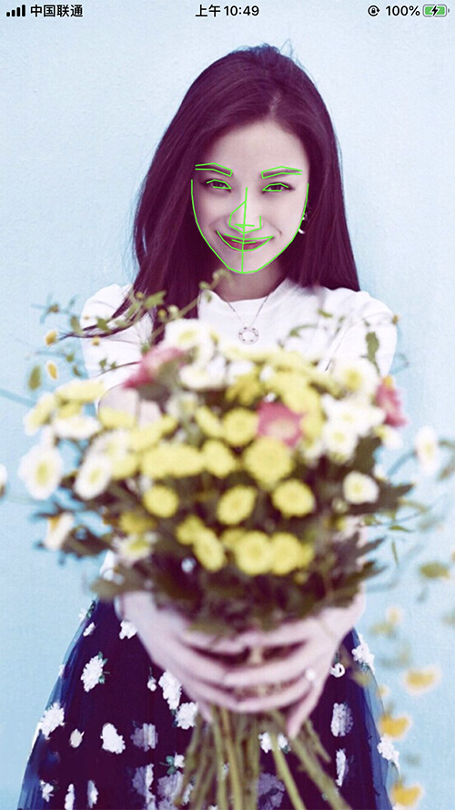
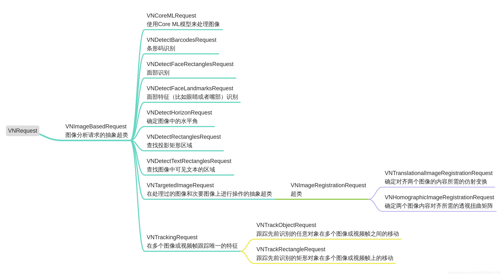
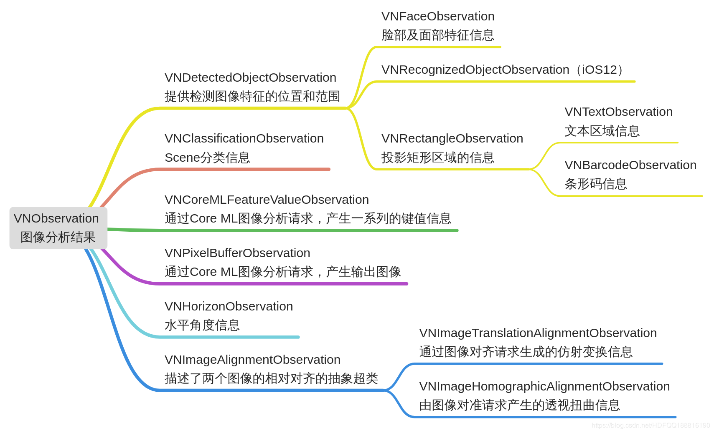

# KJVisionDemo
 
**[参考文档地址](https://www.jianshu.com/p/cb7177c3e77c)**  
**[简书文章地址](https://www.jianshu.com/p/8e06e3db8ff8)**

### 人脸矩形检测
<p align="left">
  
</p>

### 人脸特征识别
<p align="left">
  
</p>

### API架构 一 Vision框架共包括以下类 
VNRequestHandler ：继承自NSObject的VNImageRequestHandler 和 VNSequenceRequestHandler   
VNRequest ：图像分析请求的抽象超类  
VNObservation ：图像分析结果的抽象超类  
VNFaceLandmarks ：面部信息类  
VNError ：错误信息类  
VNUtils ：工具类  
VNTypes  
两个协议：VNRequestRevisionProviding 和 VNFaceObservationAccepting

<p align="left">
  
</p>
<p align="left">
  
</p>

### Vison 的应用场景
1、图像配准    
2、矩形检测    
3、二维码/条形码检测    
4、目标跟踪：脸部，矩形和通用模板    
5、文字检测：监测文字外框和文字识别    
6、人脸检测：支持检测笑脸、侧脸、局部遮挡脸部、戴眼镜和帽子等场景，可以标记出人脸的矩形区域    
7、人脸特征点：可以标记出人脸和眼睛、眉毛、鼻子、嘴、牙齿的轮廓，以及人脸的中轴线    

### Vision 支持多种图片类型
>CIImage、NSURL、NSData、CGImageRef、CVPixelBufferRef


----------------------------------------
### 框架整体介绍
* [作者信息](#作者信息)
* [作者其他库](#作者其他库)
* [使用方法](#使用方法)
* [Bug总结](#Bug总结)

#### <a id="作者信息"></a>作者信息
> Github地址：https://github.com/yangKJ  
> 简书地址：https://www.jianshu.com/u/c84c00476ab6  
> 博客地址：https://blog.csdn.net/qq_34534179  

#### <a id="作者其他库"></a>作者其他Pod库
```
播放器 - KJPlayer是一款视频播放器，AVPlayer的封装，继承UIView
pod 'KJPlayer'  # 播放器功能区
pod 'KJPlayer/KJPlayerView'  # 自带展示界面

实用又方便的Category和一些自定义控件
pod 'KJEmitterView'
pod 'KJEmitterView/Function'#
pod 'KJEmitterView/Control' # 自定义控件

轮播图 - 支持缩放 多种pagecontrol 支持继承自定义样式 自带网络加载和缓存
pod 'KJBannerView'  # 轮播图，网络图片加载

菜单控件 - 下拉控件 选择控件
pod 'KJMenuView' # 菜单控件

加载Loading - 多种样式供选择
pod 'KJLoadingAnimation' # 加载控件

```

##### Issue
如果您在使用中有好的需求及建议，或者遇到什么bug，欢迎随时issue，我会及时的回复，有空也会不断优化更新这些库

#### <a id="使用方法"></a>使用方法
##### 1、流程   
```
给各种功能的 Request 提供给一个 RequestHandler
RequestHandler持有需要识别的图片信息
并将处理结果分发给每个 Request 的 completion Block 中
可以从 results 属性中得到 Observation 信息数组
```
##### 2、代码示例
```
//
//  ViewController.m
//  KJVisionDemo
//
//  Created by 杨科军 on 2019/10/31.
//  Copyright © 2019 杨科军. All rights reserved.
//

#import "ViewController.h"
#import "KJVisionTool.h"
@interface ViewController ()
@property (nonatomic, strong) UIImageView *imageView;
@property (nonatomic, strong) NSMutableArray *temps;
@end

@implementation ViewController

- (void)viewDidLoad {
    [super viewDidLoad];
    // Do any additional setup after loading the view.
    self.temps = [NSMutableArray array];
    [self.view addSubview:self.imageView];
    UIImage *image = [UIImage imageNamed:@"AAA"];
    self.imageView.image = image;
    [KJVisionTool kj_detectImageWithType:(KJDetectFaceTypeRectanglesRequest) Image:image Block:^(NSArray * _Nonnull datas) {
        self.imageView.image = [KJVisionTool kj_drawImage:image Rects:datas];
    }];
    return;
    
//    [KJVisionTool kj_detectImageWithType:(KJDetectFaceTypeLandmarksRequest) Image:image Block:^(NSArray * _Nonnull datas) {
//        if (datas.count) {
//            KJVisionModel *model = datas[0];
//            self.imageView.image = [KJVisionTool kj_drawImage:image Observation:model.observation LandMarkPoints:model.allPoints];
//        }
//    }];
//    return;
    
//    [KJVisionTool kj_dynamicDetectFaceWithSuperView:self.view Block:^(NSArray * _Nonnull datas) {
//        dispatch_async(dispatch_get_main_queue(), ^{
//            //先移除之前的矩形框
//            [self.temps makeObjectsPerformSelector:@selector(removeFromSuperlayer)];
////            AVCaptureDevicePosition position = [[self.avInput device] position];
//            for (VNFaceObservation *faceObservation in datas) {
//                //boundingBox
//                CGRect transFrame = kj_convertRect(faceObservation.boundingBox, self.view.frame.size);
////                //前置摄像头的时候 记得转换
////                if (position == AVCaptureDevicePositionFront){
////                    transFrame.origin.x = self.view.frame.size.width - transFrame.origin.x - transFrame.size.width;
////                }
//                CALayer *rectLayer = [CALayer layer];
//                rectLayer.frame = transFrame;
//                rectLayer.borderColor = [UIColor purpleColor].CGColor;
//                rectLayer.borderWidth = 2;
//                [self.view.layer addSublayer:rectLayer];
//                [self.temps addObject:rectLayer];
//            }
//        });
//    }];
}

- (UIImageView *)imageView{
    if (!_imageView) {
        _imageView = [[UIImageView alloc]initWithFrame:self.view.bounds];
        _imageView.contentMode = UIViewContentModeScaleAspectFit;
    }
    return _imageView;
}

@end
```
##### 3、内部介绍
### 数据模型
```
@interface KJVisionModel : NSObject
// 包含该面部特征的的数组
@property (nonatomic, strong) NSMutableArray *allPoints;
//
@property (nonatomic, strong) VNFaceObservation *observation;
// 脸部轮廊
@property (nonatomic, strong) VNFaceLandmarkRegion2D *faceContour;
// 左眼，右眼
@property (nonatomic, strong) VNFaceLandmarkRegion2D *leftEye;
@property (nonatomic, strong) VNFaceLandmarkRegion2D *rightEye;
// 鼻子，鼻嵴
@property (nonatomic, strong) VNFaceLandmarkRegion2D *nose;
@property (nonatomic, strong) VNFaceLandmarkRegion2D *noseCrest;
@property (nonatomic, strong) VNFaceLandmarkRegion2D *medianLine;
// 外唇，内唇
@property (nonatomic, strong) VNFaceLandmarkRegion2D *outerLips;
@property (nonatomic, strong) VNFaceLandmarkRegion2D *innerLips;
// 左眉毛，右眉毛
@property (nonatomic, strong) VNFaceLandmarkRegion2D *leftEyebrow;
@property (nonatomic, strong) VNFaceLandmarkRegion2D *rightEyebrow;
// 左瞳,右瞳
@property (nonatomic, strong) VNFaceLandmarkRegion2D *leftPupil;
@property (nonatomic, strong) VNFaceLandmarkRegion2D *rightPupil;

@end
```
### 方法介绍
```
typedef NS_ENUM(NSUInteger,KJDetectFaceType) {
    KJDetectFaceTypeRectanglesRequest = 0, // 人脸矩形检测
    KJDetectFaceTypeLandmarksRequest, // 人脸特征识别
    KJDetectFaceTypeTextRectangles,   // 文字识别
};

typedef void (^KJVisionDatasBlock)(NSArray *datas);

@interface KJVisionTool : KJVisionModel

/// 识别图片
+ (void)kj_detectImageWithType:(KJDetectFaceType)type Image:(UIImage*)image Block:(KJVisionDatasBlock)block;

/// 在返回结果中的boundingBox中的坐标，我们并不能立即使用，而是需要进行转换
/// 因为这里是相对于image的一个比例，这里需要注意的是y坐标的转换，因为坐标系的y轴和UIView的y轴是相反的
/// 最后就是通过返回的坐标进行矩形的绘制
+ (UIImage*)kj_drawImage:(UIImage*)image Rects:(NSArray*)rects;

+ (UIImage *)kj_drawImage:(UIImage*)image Observation:(VNFaceObservation*)observation LandMarkPoints:(NSArray*)pointArray;

/// 动态识别
+ (void)kj_dynamicDetectFaceWithSuperView:(UIView*)view Block:(KJVisionDatasBlock)block;

@end
```
### 实现代码
```
@interface KJVisionTool ()<AVCaptureVideoDataOutputSampleBufferDelegate>
@property(nonatomic,copy,class) KJVisionDatasBlock xxblock;
@property(nonatomic,strong) UIView *superView;
@property(nonatomic,strong) AVCaptureSession *captureSession;
@property(nonatomic,strong) AVCaptureDevice *videoDevice;
@property(nonatomic,strong) AVCaptureDeviceInput *videoInput;
@property(nonatomic,strong) AVCaptureVideoDataOutput *dataOutput;
@property(nonatomic,strong) AVCaptureVideoPreviewLayer *captureVideoPreviewLayer;
@end

@implementation KJVisionTool
static KJVisionTool *tool = nil;
static KJVisionDatasBlock _xxblock = nil;
+ (KJVisionDatasBlock)xxblock{
    if (_xxblock == nil) {
        _xxblock = ^void(NSArray*datas){ };
    }
    return _xxblock;
}
+ (void)setXxblock:(KJVisionDatasBlock)xxblock{
    if (xxblock != _xxblock) {
        _xxblock = [xxblock copy];
    }
}
/// 识别图片
+ (void)kj_detectImageWithType:(KJDetectFaceType)type Image:(UIImage*)image Block:(KJVisionDatasBlock)block{
    self.xxblock = block;
    // 转换CIImage，创建处理VNImageRequestHandler
    VNImageRequestHandler *handler = [[VNImageRequestHandler alloc]initWithCIImage:[[CIImage alloc]initWithImage:image] options:@{}];
    VNImageBasedRequest *request = [self detectRequestWithType:type Image:image];
    // 发送识别请求
    [handler performRequests:@[request] error:nil];
}

+ (VNImageBasedRequest*)detectRequestWithType:(KJDetectFaceType)type Image:(UIImage*)image{
    VNImageBasedRequest *detectRequest = [[VNImageBasedRequest alloc]init];
    __weak typeof(self) weakself = self;
    if (type == KJDetectFaceTypeRectanglesRequest) {
        detectRequest = [[VNDetectFaceRectanglesRequest alloc] initWithCompletionHandler:^(VNRequest * _Nonnull request, NSError * _Nullable error) {
            [weakself VNDetectFaceRectanglesRequest:request image:image];
        }];
    }else if (type == KJDetectFaceTypeLandmarksRequest) {
        detectRequest = [[VNDetectFaceLandmarksRequest alloc] initWithCompletionHandler:^(VNRequest * _Nonnull request, NSError * _Nullable error) {
            [weakself VNDetectFaceLandmarksRequest:request];
        }];
    }else if (type == KJDetectFaceTypeTextRectangles) {
        detectRequest = [[VNDetectTextRectanglesRequest alloc] initWithCompletionHandler:^(VNRequest * _Nonnull request, NSError * _Nullable error) {
            
        }];
        ((VNDetectTextRectanglesRequest*)detectRequest).reportCharacterBoxes = YES;// 设置识别具体文字
    }
    return detectRequest;
}

/// 动态识别
+ (void)kj_dynamicDetectFaceWithSuperView:(UIView*)view Block:(KJVisionDatasBlock)block{
    self.xxblock = block;
    @synchronized (self) {
        if (tool == nil) {
            tool = [[KJVisionTool alloc]init];
        }
    }
//    //顺时针 90°
//    CGAffineTransform t = CGAffineTransformMakeTranslation(view.frame.size.height,.0);
//    view.transform = mixedTransform;//CGAffineTransformRotate(t, M_PI_2);
    tool.superView = view;
    /// 权限检测
    [tool getAuthorization];
}

#pragma mark - 处理相关
// 处理人脸识别回调
+ (void)VNDetectFaceRectanglesRequest:(VNRequest*)request image:(UIImage *)image{
    _xxblock(({
        NSMutableArray *temps = [NSMutableArray array];
        for (VNFaceObservation *observation in request.results) {
            NSValue *ractValue = [NSValue valueWithCGRect:kj_convertRect(observation.boundingBox, image.size)];
            [temps addObject:ractValue];
        }
        temps;
    }));
}
// 处理人脸特征回调
+ (void)VNDetectFaceLandmarksRequest:(VNRequest*)request{
    _xxblock(({
        NSMutableArray *temps = [NSMutableArray array];
        NSArray *keys = kj_getAllKeys([VNFaceLandmarks2D class], true);
        NSArray *modelKeys = kj_getAllKeys([KJVisionModel class], true);
        for (VNFaceObservation *observation in request.results) {
            // 创建特征存储对象
            KJVisionModel *model = [[KJVisionModel alloc]init];
            for (NSString *key in keys) {
                // 过滤属性
                if ([key isEqualToString:@"allPoints"] || [key isEqualToString:@"observation"] ||
                    ![modelKeys containsObject:key]) continue;
                // 得到对应细节具体特征
                VNFaceLandmarkRegion2D *region2D = [observation.landmarks valueForKey:key];
                [model.allPoints addObject:region2D];
                // 特征存储对象进行存储
                [model setValue:region2D forKey:key];
            }
            model.observation = observation;
            [temps addObject:model];
        }
        temps;
    }));
}


#pragma mark - 内部方法
static inline CGRect kj_convertRect(CGRect rect,CGSize size){
    CGFloat w = rect.size.width * size.width;
    CGFloat h = rect.size.height * size.height;
    CGFloat x = rect.origin.x * size.width;
    CGFloat y = size.height - (rect.origin.y * size.height) - h;
    return CGRectMake(x, y, w, h);
}
/// 获取对象属性keys
static inline NSArray * kj_getAllKeys(Class clazz,bool isProperty){
    NSMutableArray *keys = [NSMutableArray array];
    unsigned int count = 0;
    Ivar *vars = NULL;
    objc_property_t *propertys = NULL;
    const char *name;
    if (isProperty) {
        propertys = class_copyPropertyList(clazz, &count);
    }else{
        vars = class_copyIvarList(clazz, &count);
    }
    for (int i = 0; i < count; i++) {
        name = isProperty ? property_getName(propertys[i]) : ivar_getName(vars[i]);
        [keys addObject:[NSString stringWithUTF8String:name]];
    }
    free(vars);
    return keys.copy;
}

#pragma mark - 公用方法
/// 在返回结果中的boundingBox中的坐标，我们并不能立即使用，而是需要进行转换
/// 因为这里是相对于image的一个比例，这里需要注意的是y坐标的转换，因为坐标系的y轴和UIView的y轴是相反的
/// 最后就是通过返回的坐标进行矩形的绘制
+ (UIImage*)kj_drawImage:(UIImage*)image Rects:(NSArray*)rects{
    UIImage *newImage = nil;
    UIGraphicsBeginImageContextWithOptions(image.size, NO, [UIScreen mainScreen].scale);
    CGContextRef context = UIGraphicsGetCurrentContext();
    CGContextSetLineCap(context,kCGLineCapRound); //边缘样式
    CGContextSetLineJoin(context,kCGLineJoinRound);
    CGContextSetLineWidth(context,2); //线宽
    CGContextSetAllowsAntialiasing(context,YES); //打开抗锯齿
    CGContextSetStrokeColorWithColor(context,UIColor.redColor.CGColor); /// 边框颜色
    CGContextSetFillColorWithColor(context,UIColor.clearColor.CGColor); /// 填充颜色
    
    //绘制图片
    [image drawInRect:CGRectMake(0, 0,image.size.width, image.size.height)];
    CGContextBeginPath(context);
    for (int i = 0; i < rects.count; i ++) {
        CGRect rect = [rects[i] CGRectValue];
        CGPoint sPoints[4];//坐标点
        sPoints[0] = CGPointMake(rect.origin.x , rect.origin.y);//坐标1
        sPoints[1] = CGPointMake(rect.origin.x + rect.size.width, rect.origin.y);//坐标2
        sPoints[2] = CGPointMake(rect.origin.x + rect.size.width, rect.origin.y + rect.size.height);//坐标3
        sPoints[3] = CGPointMake(rect.origin.x , rect.origin.y + rect.size.height);
        CGContextAddLines(context, sPoints, 4);//添加线
        CGContextClosePath(context); //封闭
    }
    CGContextDrawPath(context, kCGPathFillStroke); //根据坐标绘制路径
    newImage = UIGraphicsGetImageFromCurrentImageContext();
    UIGraphicsEndImageContext();
    return newImage;
}

+ (UIImage *)kj_drawImage:(UIImage*)image Observation:(VNFaceObservation*)observation LandMarkPoints:(NSArray*)points{
    UIImage *newImage = image;
    // 遍历所有特征
    for (VNFaceLandmarkRegion2D *landmarks2D in points) {
        CGPoint points[landmarks2D.pointCount];
        // 转换特征的所有点
        for (int i=0; i<landmarks2D.pointCount; i++) {
            CGPoint point = landmarks2D.normalizedPoints[i];
            CGFloat rectWidth = newImage.size.width * observation.boundingBox.size.width;
            CGFloat rectHeight = newImage.size.height * observation.boundingBox.size.height;
            points[i] = CGPointMake(point.x * rectWidth + observation.boundingBox.origin.x * newImage.size.width, observation.boundingBox.origin.y * newImage.size.height + point.y * rectHeight);
        }
        UIGraphicsBeginImageContextWithOptions(newImage.size, false, 1);
        CGContextRef context = UIGraphicsGetCurrentContext();
        [UIColor.greenColor set]; // 线条颜色
        CGContextSetLineWidth(context, 2);//线宽
        
        // 设置翻转
        CGContextTranslateCTM(context, 0, newImage.size.height);
        CGContextScaleCTM(context, 1.0, -1.0);
        
        // 设置线类型
        CGContextSetLineJoin(context, kCGLineJoinRound);
        CGContextSetLineCap(context, kCGLineCapRound);
        
        // 设置抗锯齿
        CGContextSetShouldAntialias(context, true);
        CGContextSetAllowsAntialiasing(context, true);
        
        // 绘制
        CGRect rect = CGRectMake(0, 0, newImage.size.width, newImage.size.height);
        CGContextDrawImage(context, rect, newImage.CGImage);
        CGContextAddLines(context, points, landmarks2D.pointCount);
        CGContextDrawPath(context, kCGPathStroke);
        
        // 结束绘制
        newImage = UIGraphicsGetImageFromCurrentImageContext();
        UIGraphicsEndImageContext();
    }
    return newImage;
}

#pragma mark - 动态识别相关
/// 初始化相关内容
- (void)initCapture{
    [self addSession];
    [_captureSession beginConfiguration];
    
    [self addVideo];
    [self addPreviewLayer];
    
    [_captureSession commitConfiguration];
    [_captureSession startRunning];
}
/// 获取权限
- (void)getAuthorization{
    AVAuthorizationStatus videoStatus = [AVCaptureDevice authorizationStatusForMediaType:AVMediaTypeVideo];
    if (videoStatus == AVAuthorizationStatusAuthorized || videoStatus == AVAuthorizationStatusNotDetermined) {
        [self initCapture];
    }else if (videoStatus == AVAuthorizationStatusDenied || videoStatus == AVAuthorizationStatusRestricted) {
        NSLog(@"相机未授权");
    }
}
/// 获取设备
- (AVCaptureDevice*)deviceWithMediaType:(NSString *)mediaType preferringPosition:(AVCaptureDevicePosition)position{
    AVCaptureDeviceDiscoverySession *session = [AVCaptureDeviceDiscoverySession  discoverySessionWithDeviceTypes:@[AVCaptureDeviceTypeBuiltInWideAngleCamera] mediaType:AVMediaTypeVideo position:position];
    for (AVCaptureDevice *device in session.devices) {
        if ([device position] == position) return device;
    }
    return nil;
}
/// 添加预览视图
- (void)addPreviewLayer{
    // 通过会话 (AVCaptureSession) 创建预览层
    _captureVideoPreviewLayer = [[AVCaptureVideoPreviewLayer alloc] initWithSession:_captureSession];
    _captureVideoPreviewLayer.frame = self.superView.bounds;
    
    //有时候需要拍摄完整屏幕大小的时候可以修改这个
    _captureVideoPreviewLayer.videoGravity = AVLayerVideoGravityResizeAspectFill;
    _captureVideoPreviewLayer.connection.videoOrientation = 3;
    
    // 显示在视图表面的图层
    CALayer *layer = self.superView.layer;
    layer.masksToBounds = true;
    [layer addSublayer:_captureVideoPreviewLayer];
}
/// 添加video
- (void)addVideo{
    /// AVCaptureDevicePositionBack后置摄像头
    _videoDevice = [self deviceWithMediaType:AVMediaTypeVideo preferringPosition:AVCaptureDevicePositionBack];
    [self addVideoInput];
    [self addDataOutput];
}
/// 添加videoinput
- (void)addVideoInput{
    _videoInput = [[AVCaptureDeviceInput alloc] initWithDevice:_videoDevice error:NULL];
    // 将视频输入对象添加到会话 (AVCaptureSession) 中
    if ([_captureSession canAddInput:_videoInput]) {
        [_captureSession addInput:_videoInput];
    }
}
/// 添加数据输出
- (void)addDataOutput{
    // 拍摄视频输出对象
    // 初始化输出设备对象，用户获取输出数据
    _dataOutput = [[AVCaptureVideoDataOutput alloc] init];
    [_dataOutput setSampleBufferDelegate:self queue:dispatch_queue_create("CameraCaptureSampleBufferDelegateQueue", NULL)];
    if ([_captureSession canAddOutput:_dataOutput]) {
        [_captureSession addOutput:_dataOutput];
        //需要重新进行配置输出 特别是下面的输出方向
        AVCaptureConnection *captureConnection = [_dataOutput connectionWithMediaType:AVMediaTypeVideo];
        if ([captureConnection isVideoOrientationSupported]) {
            [captureConnection setVideoOrientation:AVCaptureVideoOrientationPortrait];
        }
        // 视频稳定设置
        if ([captureConnection isVideoStabilizationSupported]) {
            captureConnection.preferredVideoStabilizationMode = AVCaptureVideoStabilizationModeAuto;
        }
        // 设置输出图片方向
        captureConnection.videoOrientation = AVCaptureVideoOrientationPortrait;
    }
}
- (void)addSession{
    _captureSession = [[AVCaptureSession alloc] init];
    //设置视频分辨率
    //注意,这个地方设置的模式/分辨率大小将影响你后面拍摄照片/视频的大小,
    if ([_captureSession canSetSessionPreset:AVCaptureSessionPresetHigh]) {
        [_captureSession setSessionPreset:AVCaptureSessionPresetHigh];
    }
}

#pragma mark - AVCaptureVideoDataOutputSampleBufferDelegate
/// 获取输出
- (void)captureOutput:(AVCaptureFileOutput *)output didOutputSampleBuffer:(CMSampleBufferRef)sampleBuffer fromConnection:(AVCaptureConnection *)connection{
    CVPixelBufferRef BufferRef = CMSampleBufferGetImageBuffer(sampleBuffer);
    VNDetectFaceRectanglesRequest *detectFaceRequest = [[VNDetectFaceRectanglesRequest alloc] init];
    VNImageRequestHandler *detectFaceRequestHandler = [[VNImageRequestHandler alloc]initWithCVPixelBuffer:BufferRef options:@{}];
    [detectFaceRequestHandler performRequests:@[detectFaceRequest] error:nil];
    /// 输出数据
    _xxblock(detectFaceRequest.results);
}

@end
```